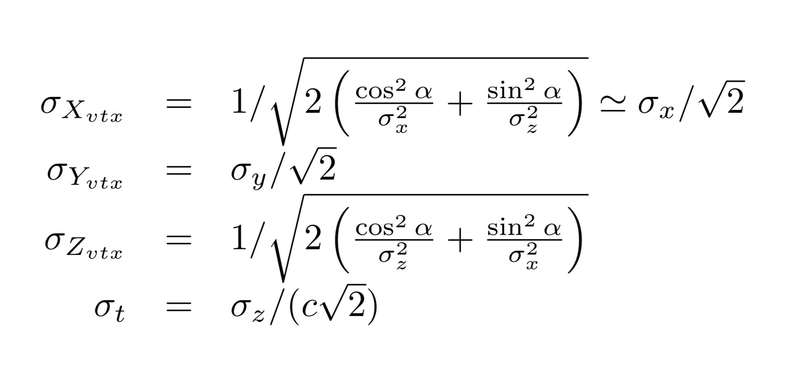
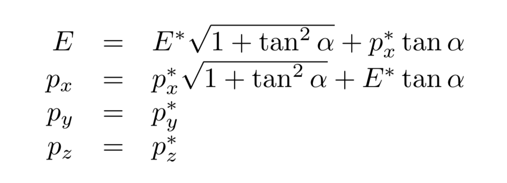

# General information


### Table of Contents

1. [Common event samples](#common-event-samples)
2. [Example analyses and how-to's](#example-analyses-and-how-to's)
    1. [Basics](#Basics)
    2. [How to associate RecoParticles with Monte-Carlo Particles](#How-to-associate-RecoParticles-with-Monte-Carlo-Particles)
    3. [How to navigate through the history of the Monte-Carlo particles](#How-to-navigate-through-the-history-of-the-Monte-Carlo-particles)
    4. [How to compute event variables (thrust, sphericity, etc)](#How-to-compute-event-variables-thrust-sphericity-etc)
    5. [How to fit tracks to a common vertex](#How-to-fit-tracks-to-a-common-vertex)
    6. [How to run jet algorithms](#How-to-run-jet-algorithms)
    7. [How to run kinematic fits](#How-to-run-kinematic-fits)
3. [Code development](#code-development)
4. [To produce your own Delphes samples](#to-produce-your-own-delphes-samples)
    1. [Quick instructions for producing samples](#quick-instructions-for-producing-samples)
    2. [Make simple changes to the tracker or beam-pipe description in Delphes](#make-simple-changes-to-the-tracker-or-beam-pipe-description-in-delphes)
    1. [Change the Jet algorithms](#change-the-jet-algorithm-in-the-delphes-interface)
5. [The five-parameter tracks produced by the Delphes interface](#the-five-parameter-tracks-produced-by-the-delphes-interface)
6. [Vertexing and flavour tagging](#vertexing-and-flavour-tagging)
    1. [Vertex-fitter code from Franco Bedeschi](#vertex-fitter-code-from-franco-bedeschi)
    2. [Vertexing with the ACTS suite](#vertexing-with-the-acts-suite)
    3. [The LCFI+ algorithm](#the-LCFIPlus-algorithm)
    4. [The DecayTreeFitter (DTF) algorithm](#the-decaytreefitter-dtf-algorithm)
    5. [Flavour tagging using machine learning](#flavour-tagging-using-machine-learning)
7. [Making particle combinations with awkward arrays](#making-particle-combinations-with-awkward-arrays)
8. [Generating events under realistic FCC-ee environment conditions](#generating-events-under-realistic-fcc-ee-environment-conditions)
    1. [Beam energy spread](#beam-energy-spread)
    2. [Vertex distribution](#vertex-distribution)
    3. [Transverse boost to account for the crossing angle](#transverse-boost-to-account-for-the-crossing-angle)
9. [Monte-Carlo programs](#monte-carlo-programs)
10. [Bibliography](#bibliography)


### Common event samples

<!---
#### Delphes samples (FCCSW), September 2020"
Some samples in FCC-EDM (ZH, ZZ and WW, at sqrts = 240 GeV) have been produced (Sep 2020) for the Snowmass Software tutorial.
The events were simulated with Delphes, with the "IDEA\_TrkCov" card. They are on EOS at CERN, details can be found [here](http://fcc-physics-events.web.cern.ch/fcc-physics-events/Delphesevents_fccee_v02.php).
-->

<!---
#### Delphes samples in EDM4HEP, Nov 2020
A large set of DELPHES samples (Pythia) have been produced (C. Helsens) in EDM4HEP, using the "IDEA\_TrkCov" card, and are stored in EOS.
See [here for the EOS path, number of events, cross-section, etc](http://fcc-physics-events.web.cern.ch/fcc-physics-events/Delphesevents_fccee_tmp.php).
The Pythia cards can be found in EOS in /eos/experiment/fcc/ee/utils/pythiacards, and the DELPHES card used for this production is in /eos/experiment/fcc/ee/utils/delphescards/fcc\_tmp.    
*Caveats: beam-energy spread is not included ; and these samples are known to have an issue with the associations for electrons.*
  
- Samples at √s = 91 GeV
  - Inclusive samples :
    - Z → tau tau; Z → light jets; Z → cc ; Z → bb 
  - Exclusive samples :
    - many Z → bb samples with exclusive decays performed by EVTGEN, for flavour physics
    - Z → tau tau with tau → µ gamma
- Samples at √s = 125 GeV: 
  - ee → H with H → gg ; H → bb ; H → cc ; H → tau tau
  - diboson production: ee → WW, ee → ZZ, ee → H
  - Drell-Yan : tautau, qq, bb, cc
- Samples at √s = 240 GeV: 
  - ee → ZH
  - diboson production: ee → WW, ee → ZZ
- Samples at √s = 365 GeV:
  - ttbar, ZZ, WW, ZH production
  - ttbar, ZZ and WW in the full hadronic channel
-->


#### The "spring2021" Monte-Carlo samples (May 2021)

- some input on the MC production had been collected in early 2021 at [this googledoc](https://docs.google.com/document/d/1-3L_8u542-dlaL6ws41PYmCgwzffgsleaQKs_qQb6AM/edit#).
- Details of the spring2021 samples:
  - the production  uses the [EventProducer](https://github.com/HEP-FCC/EventProducer) developed by C. Helsens.
  - release from 2021-04-30, uses Delphes 3.4.3pre10
  - configuration cards (delphes cards, Monte-Carlo cards): see the  [FCC-configs repository](https://github.com/HEP-FCC/FCC-config), branch  **spring2021**.
 <!---
  - Main changes compared to the "tmp" samples:
    - bugfix of the MC-associations for electrons
    - beam-pipe model updated
    - better resolution for displaced tracks; 
    - the error matrix of the track parameters now include also the off-diagonal terms
    - addition of "inclusive" (non-isolated) muons in the output files
-->
  - See [here for  information about the files made with IDEA](http://fcc-physics-events.web.cern.ch/fcc-physics-events/Delphesevents_spring2021_IDEA.php)
  - The event files can be found in EOS /eos/experiment/fcc/ee/generation/DelphesEvents/spring2021
  - a few files were produced, corresponding to [IDEA with  a  3T field](http://fcc-physics-events.web.cern.ch/fcc-physics-events/Delphesevents_spring2021_IDEA_3T.php), and to "IDEA" where the Drift Chamber was repaced by the CLD tracker

##### Known caveats in the "spring2021" samples:
- there is some inefficiency for electrons, due primarily to the overlap removal procedure, see [Jean-Loup's talk](https://indico.cern.ch/event/1076058/contributions/4525652/attachments/2312556/3935839/Angular%20analysis%20ee%20-%20WW%20final%20states.pdf) and [here](https://indico.cern.ch/event/1085888/contributions/4565672/attachments/2329756/3969735/2021_10_18_PPC_News.pdf)
- the efficiency for very low momentum tracks is lower than what it should be, see [Tristan's talk](https://indico.cern.ch/event/1076058/contributions/4525621/attachments/2312669/3936050/Talk_FCC_miralles.pdf) and [here](https://indico.cern.ch/event/1085888/contributions/4565672/attachments/2329756/3969735/2021_10_18_PPC_News.pdf)
- the jets that are on the EDM4Hep files, i.e. that were produced during the Delphes step, **should not be used**. See [Jean-Loup's talk](https://indico.cern.ch/event/1076058/contributions/4525652/attachments/2312556/3935839/Angular%20analysis%20ee%20-%20WW%20final%20states.pdf) and [here](https://indico.cern.ch/event/1096051/contributions/4614509/attachments/2344926/3998410/2021_11_12_News.pdf). The issue lies in the Delphes card that was used (some jets are suppressed in the overlap removal procedure). The solution is to **re-cluster the jets in FCCAnalyses, as explained below.**

### Example analyses and how-to's

Example analyses can be found in the [FCCAnalyses repository](https://github.com/HEP-FCC/FCCAnalyses).
Checkout the master branch if you want to analyze EDM4HEP samples (the fccedm branch contains examples for the FCCSW-FCCEDM samples).
And follow the instructions in the README of [FCCAnalyses repository](https://github.com/HEP-FCC/FCCAnalyses).

#### Basics
- A first introduction to FCCAnalyses was also given in [Clement's talk at our December 2021 Phys Perf meeting](https://indico.cern.ch/event/982690/contributions/4138504/attachments/2162441/3648904/FCCAnalyses_clement.pdf).
- Basic documentation can be found [here](https://github.com/HEP-FCC/FCCAnalyses/tree/master/examples/basics). The configuration file [read_EDM4HEP.py](https://github.com/HEP-FCC/FCCAnalyses/tree/master/examples/basics/read_EDM4HEP.py) contains a few comments, which can help people get started. 
- First example, Higgs mass recoil : Simple example used in the README: [examples/FCCee/higgs/mH-recoil/mumu/](https://github.com/HEP-FCC/FCCAnalyses/tree/master/examples/FCCee/higgs/mH-recoil/mumu)

#### How to associate RecoParticles with Monte-Carlo Particles
- see explanations [here](https://github.com/HEP-FCC/FCCAnalyses/tree/master/examples/basics#association-between-RecoParticles-and-MonteCarloParticles)
<!---
- see also the example in [examples/FCCee/flavour/generic-analysis](https://github.com/HEP-FCC/FCCAnalyses/tree/master/examples/FCCee/flavour/generic-analysis)  shows how the associations work (how to retrieve the Monte-Carlo particle associated to a reconstructed particle; how to retrieve the track of a reconstructed particle)
-->

#### How to navigate through the history of the Monte-Carlo particles
- see exaplanations [here](https://github.com/HEP-FCC/FCCAnalyses/tree/master/examples/basics#Navigation-through-the-history-of-the-MonteCarloParticles)

#### How to compute event variables (thrust, sphericity, etc)
- see an example in [examples/FCCee/flavour/Bc2TauNu](https://github.com/HEP-FCC/FCCAnalyses/blob/master/examples/FCCee/flavour/Bc2TauNu/analysis_stage1.py) 

#### How to fit tracks to a common vertex 
- To see how one can run the vertex fitter over a collection of tracks, see in [examples/FCCee/vertex](https://github.com/HEP-FCC/FCCAnalyses/tree/master/examples/FCCee/vertex)
- see also various examples in this repository, [case-studies/flavour/VertexExamples](https://github.com/HEP-FCC/FCCeePhysicsPerformance/tree/master/case-studies/flavour/VertexExamples)
- and some links below 

#### How to run jet algorithms
- To see how one can run a jet algorithm over a collection of particles, see in [examples/FCCee/top/hadronic](https://github.com/HEP-FCC/FCCAnalyses/blob/master/examples/FCCee/top/hadronic/analysis_stage1.py). This is an interface to FastJet, although not all the algorithms that are implemented in FastJet are currently available in this interface. See in [JetClustering.h](https://github.com/HEP-FCC/FCCAnalyses/blob/master/analyzers/dataframe/FCCAnalyses/JetClustering.h) for more details.
- remember: the jets that are on the (spring2021) EDM4Hep files **should not be used**, see the caveats above
- details on the interface to FastJet in FCCAnalyses can be found in [Julie Torndal's thesis](https://cernbox.cern.ch/index.php/s/UJ179yqvXhzTvJZ)
- please read the [FastJet manual](https://arxiv.org/abs/1111.6097)
- [Basic guidance on jet algorithms (& FastJet) at FCC-ee](https://indico.cern.ch/event/1173562/contributions/4929025/attachments/2470068/4237859/2022-06-FCC-jets.pdf): talk by Gavin Salam, Gregory Soyez and Matteo Cacciari at the Physics Performance meeting of June 27, 2022. Most recommended.

#### How to run kinematic fits
- see the ABCfit++ software package described in [Julie Torndal's thesis](https://cernbox.cern.ch/index.php/s/UJ179yqvXhzTvJZ)
- stand-alone package for the while, see the [github repo](https://github.com/Torndal/ABCfitplusplus)


### Code development

Generalities:
- Code that is "general", expected to be useful for many analyses, is hosted into the [FCCAnalyses](https://github.com/HEP-FCC/FCCAnalyses) repository. 
- Code that is very specific to an analysis is expected to go into the "case-studies" directory of the [FCCeePhysicsPerformance](https://github.com/HEP-FCC/FCCeePhysicsPerformance) repository. For example, in [FCCeePhysicsPerformance/case-studies/flavour/dataframe/analyzers/](https://github.com/HEP-FCC/FCCeePhysicsPerformance/tree/master/case-studies/flavour/dataframe/analyzers), there  is a Bs2DsK.cc which contains some code  that is specific to the reconstruction of the Bs to DsK decay; for examples that use this code, and for the recipe to  set up the envirionment,  see in [flavour/VertexExamples](https://github.com/HEP-FCC/FCCeePhysicsPerformance/tree/master/case-studies/flavour/VertexExamples).
- as a first step, since the setup is easier, you may start to  develop some code (even if it is analysis-specific) locally, in your local FCCAnalysis, and move it later to FCCeePhysicsPerformance. Or, if your code is of general interest, make a pull request such  that your code gets  merged in the central FCCAnalysis  repository.

How to add a new functionnality in FCCAnalysis:
- all the code is in [analyzers/dataframe](https://github.com/HEP-FCC/FCCAnalyses/tree/master/analyzers/dataframe)
- you may  add a new function to an existing file, for example if you add some basic functionnality that works on the Monte-Carlo particles, like retrieving the MC particle with the highest energy, it makes sense to add it into MCParticle.cc
- or you can create a new file MyStuff.cc (for example, FlavourTagging.cc, ParticleIdentification.cc, etc). In that case, you just need to create a MyStuff.h, a MyStuff.cc, and to add your MyStuff.h in the CMakeLists.txt file (look for the others .h)

 

### To produce your own Delphes samples


#### Quick instructions for producing samples 

(For FCCSW samples (old), see [this part of the tutorial](https://hep-fcc.github.io/fcc-tutorials/fast-sim-and-analysis/FccFastSimDelphes.html).)    

 For EDM4HEP samples, first define the environment :
```markdown
source /cvmfs/fcc.cern.ch/sw/latest/setup.sh
```
and take the output configuration file, [edm4hep\_output\_config.tcl](https://github.com/key4hep/k4SimDelphes/blob/main/examples/edm4hep_output_config.tcl) from key4hep/k4SimDelphes/examples.
 
- To run Pythia and Delphes :
```markdown
DelphesPythia8_EDM4HEP $DELPHES_DIR/cards/delphes_card_IDEAtrkCov.tcl edm4hep_output_config.tcl your_pythia_card.cmd outputFile.root
```
Example cards for Pythia can be found [here](https://github.com/HEP-FCC/FCC-config/tree/main/Generator/Pythia8) (not much populated yet), or in EOS at CERN, in /eos/fcc/ee/utils/pythiacards (which contains the cards for all the samples produced in November 2020).

- To read an LHE input file and process it through Delphes: the executable is the same, DelphesPythia8\_EDM4HEP, and your Pythia card should just contain:
```markdown
! 3) Tell Pythia that LHEF input is used
Beams:frameType             = 4
Beams:setProductionScalesFromLHEF = off
Beams:LHEF = your_input_file.lhe    
```

- To produce events with PYTHIA+EVTGEN and run them through Delphes:
```markdown
DelphesPythia8EvtGen_EDM4HEP $DELPHES_DIR/cards/delphes_card_IDEAtrkCov.tcl edm4hep_output_config.tcl p8_ee_Zbb_ecm91_EvtGen.cmd evtgen.root DECAY.DEC evt.pdl Bu2D0Pi.dec 
```
where evtgen.root is your output event file; p8\_ee\_Zbb\_ecm91\_EvtGen.cmd can be picked up e.g. from /eos/fcc/ee/utils/pythiacards/p8\_ee\_Zbb\_ecm91\_EvtGen\_Bu2D0Pi.cmd; Bu2D0Pi.dec is the EVTGEN file where you specify the exclusive decay(s) you want, see examples [in the HEP-FCC/FCC-config repository](https://github.com/HEP-FCC/FCC-config/tree/main/Generator/EvtGen); DECAY.DEC and evt.pdl are standard EVTGEN files that, with the environment as defined above, can be found in $EVTGEN.


#### Make simple changes to the tracker or beam-pipe description in Delphes

The geometry of the (central) beam-pipe and of the tracker is described in $DELPHES\_DIR/cards/delphes\_card\_IDEAtrkCov.tcl for the IDEA tracker. (a version of this file, in which the IDEA drift chamber is replaced by the full-Si tracker of CLD, can be found in lxplus in /afs/cern.ch/user/s/selvaggi/public/4Emilia/delphes\_card\_CLDtrkCov\_Tagging.tcl).
To see the geometry description, look for the **module TrackCovariance**, and for the lines that are under **set DetectorGeometry**. The convention is as follows:
```markdown
	// Layer type 1 = R (barrel) or 2 = z (forward/backward)
	// Layer label
	// Minimum dimension z for barrel  or R for forward  (m)
	// Maximum dimension z for barrel  or R for forward  (m)
	// R/z location of layera  (m)
	// Thickness (meters)
	// Radiation length of the material (in meters)
	// Number of measurements in layers (1D or 2D)
	// Stereo angle (rad) - 0(pi/2) = axial(z) layer - Upper side
	// Stereo angle (rad) - 0(pi/2) = axial(z) layer - Lower side
	// Resolution Upper side (meters) - 0 = no measurement
	// Resolution Lower side (meters) - 0 = no measurement
	// measurement flag = T, scattering only = F
```
For example, in the default description, the first line:
```markdown
      1 PIPE -100 100 0.015 0.0012 0.35276 0 0 0 0 0 0
```
tells that the beam-pipe is at R = 1.5 cm (inner radius), has a thickness of 1.2 mm, and that the radiation length of the corresponding material is 0.35276 m (the X0 of Berrylium).
In the next lines, corresponding to the vertex detector (barrel), 
```markdown
      1 VTXLOW -0.12 0.12 0.017 0.00028 0.0937 2 0 1.5708 3e-006 3e-006 1
      1 VTXLOW -0.16 0.16 0.023 0.00028 0.0937 2 0 1.5708 3e-006 3e-006 1
      1 VTXLOW -0.16 0.16 0.031 0.00028 0.0937 2 0 1.5708 3e-006 3e-006 1
```
you see that the single hit resolution if each layer is 3 mum. At the end of this module, you see the value of the magnetic field that is used (**set Bz 2.0**), which also needs to be set in the  ParticlePropagator module.    

One can play with these values, to see e.g. how the performance changes when one sets the (beam-pipe and) innermost layer of the vertex detector closer to the beam-line, etc.


#### Change the Jet algorithm in the Delphes interface

- The choice of which jet algorithm is run (for the jets that are written to the EDM4HEP file) is made in the Delphes cards. Note however that, at the analysis level, it is possible to re-run the jet clustering, using another algorithm than the one used when the file was produced. See above, "Example analyses", for more information about this possibility. To change the algorithm that is run when the EDM4HEP file is produced, look up in the Delphes card:

```markdown
module FastJetFinder GenJetFinder {
  set InputArray NeutrinoFilter/filteredParticles

  set OutputArray jets

  # algorithm: 1 CDFJetClu, 2 MidPoint, 3 SIScone, 4 kt, 5 Cambridge/Aachen, 6 antikt
  set JetAlgorithm 6
  set ParameterR 0.4
  set JetPTMin 1.0
}
```

- In some cases, it may  be desirable to run the algorithm in the "exclusive" mode, forcing the algorithm to produce a fixed number of jets. This can be done by setting the following parameters in the Delphes FastJet finder:

```markdown
module FastJetFinder GenJetFinder {
   set ExclusiveClustering  True
   set NJets  2
.....
}
```

- Algorithms that use the difference in (pseudo-)rapidity between particles in order to define the distance are not well suited for FCC-ee. At FCC, the center-of-mass of the collisions is at rest with respect to the detector, in contrast to what happens at pp colliders. And using Delta( Eta ), instead of Delta(theta) or Delta( cos theta) is harmful, since Delta( Eta ) is not a good measure of the angular separation: for two particles that are emitted close-by and at small angle, their difference in pseudo-rapidity diverges as the log of the polar angle. Hence, using a jet  algorithm thar relies on Eta instead of the polar angle Theta will create too many jets in the forward region.


- The [VLC algorithm](https://link.springer.com/article/10.1140%2Fepjc%2Fs10052-018-5594-6) was largely used for CLIC studies (where it showed good performance in particular to reject the background from gamma gamma to hadrons, which is severe at CLIC).

- See also the [FastJet user manual](https://arxiv.org/abs/1111.6097)


### The five-parameter tracks produced by the Delphes interface

- Recent versions of Delphes offer a rather detailed modelling of the tracks via the [TrackCovariance Delphes module](https://github.com/delphes/delphes/blob/master/modules/TrackCovariance.cc), developed from a code by Franco Bedeschi. The module, in the input card, must contain a description of the tracker, see for example [the delphes_card_IDEAtrkCov.tcl](https://github.com/delphes/delphes/blob/master/cards/delphes_card_IDEAtrkCov.tcl).
(more details about the geometry description can be found above). This produces five-parameter tracks - i.e., including the transverse and longitudinal impact parameters - with their covariance matrix.
    - for more details about the TrackCovariance module, see Franco's talk at the [FCC detector meeting of March 2019](https://indico.cern.ch/event/802367/contributions/3343375/attachments/1808003/2951636/TrackingSim_WG11_FCC_March2019.pdf), or at the [CEPC meeting in Oxford, April 2019](https://indico.cern.ch/event/783429/contributions/3376675/attachments/1829951/3712651/Oxford_April2019_V1.pdf).

<!---
- In FCCSW: in order to save the 5-parameter tracks and their covariance matrix, the [DelphesSaveChargedParticles](https://github.com/HEP-FCC/FCCSW/blob/master/Sim/SimDelphesInterface/src/DelphesSaveChargedParticles.cpp) module should be configured with the flag **saveTrkCov** set to True. Example:
```markdown
chhadSaveTool = DelphesSaveChargedParticles("efcharged")
chhadSaveTool.delphesArrayName = "Calorimeter/eflowTracks"
chhadSaveTool.saveIsolation = False
chhadSaveTool.saveTrkCov = True
chhadSaveTool.particles.Path      = "efcharged"
chhadSaveTool.particles_trkCov.Path      = "efcharged_trkCov"
chhadSaveTool.mcAssociations.Path = "efchargedToMC"
```
See the [tutorial here](https://hep-fcc.github.io/fcc-tutorials/fast-sim-and-analysis/FccFastSimDelphes.html) for a usage example.
-->

- (old) In the FCCEDM output, the track parameters thar are saved are: ( d0, z0, phi, theta, q/p ) with d0 and z0 in mm and q/p in GeV-1 [TBC for q/p]. The covariance matrix is given in this basis. It is saved as 15 floats,  trkCov[0], trkCov[5], trkCov[9], trkCov[12] and trkCov[14] denoting the diagonal elements of the symmetric matrix.

- In the EDM4HEP output, the track parameters are (d0, phi, rho, z0, tanLambda), with d0 and z0 in mm and the curvature rho in mm<sup>-1</sup>. The sign convention for the curvature rho is such that with Bz > 0 , rho is positive for a particle with Q > 0. The covariance matrix is saved as 15 floats corresponding to the former basis. 
    - For files produced before end of February 2021, only the diagonal elements of the covariance matrix of the track parameters were saved. And the matrix was saved as an **upper-triangle** matrix, trkCov[0], trkCov[5], trkCov[9], trkCov[12] and trkCov[14] denoting the diagonal elements of the symmetric matrix.
    - Starting with the SW distribution deployed on Feb 26, 2021, the off-diagonal terms are stored too. Moreover, to comply with the convention used throughout EDM4HEP, **it is now the lower-triangle matrix that is stored**: trkCov[0], trkCov[2], trkCov[5], trkCov[9] and trkCov[14] denote the variances of d0, phi, rho, z0 and tanLambda; trkCov[1] is the covariance between d0 and phi, trkCov[3] between d0 and rho, etc.


### Vertexing and flavour tagging

#### Topical meeting on vertexing, Feb 10, 2021

Link to the [topical meeting on vertexing, Feb 10, 2021](https://indico.cern.ch/event/1003610/) organised jointly by Physics Performance and Software and Computing. And the [meeting summary (plus progress)](https://indico.cern.ch/event/996337/contributions/4238680/attachments/2194428/3709760/Vertexing_Summary_22_02_2021.pdf)  presented by Clement Helsens at the FCC-ee general meeting of February 22, 2021.

#### Informal e-group
An informal e-group was created after the topical meeting:   vertexing-FCCee-informal

#### Vertex-fitter code from Franco Bedeschi

A stand-alone vertex-fitter from Franco Bedeschi has been **implemented in FCCAnalyses**.
  - the algorithm was described in [Franco's talk](https://indico.cern.ch/event/1003610/contributions/4214579/attachments/2187815/3696958/Bedeschi_Vertexing_Feb2021.pdf) at the [topical meeting on vertexing, Feb 10, 2021](https://indico.cern.ch/event/1003610/).
  - Franco presented an [update at the Physics Performance meeting of July 18, 2022](https://indico.cern.ch/event/1180976/contributions/4960968/attachments/2481467/4259924/Bedeschi_Vertexing_Jul2022.pdf)
  - In FCCAnalyses, see an example usage in [examples/FCCee/vertex](https://github.com/HEP-FCC/FCCAnalyses/tree/master/examples/FCCee/vertex).
    - analysis.py runs over Z to light jet events and determines the event primary vertex
    - The macro vertex\_plots.x makes plots of the chi2 of the fit, of the resolutions of the fitted vertex position in (x, y, z), and of the corresponding pulls.
    - the code retrieves an edm4hep::VertexData object, where: 
      - the vertex coordinates (x, y, z) are in mm
      - the returned chi2 is normalised to the number of degrees of freedom of the fit ( n.d.f. = 2 x N<sub>tracks</sub> -3)
      - the covariance matrix of (x, y, z) is stored as a an array of 6 floats, corresponding to the **lower-triangle** matrix (i.e. covMat[0], covMat[2], covMat[5] denote the variances of x, y, z, respectively)
    - the code is in [analyzers/dataframe/VertexFitterSimple.cc](https://github.com/HEP-FCC/FCCAnalyses/blob/master/analyzers/dataframe/src/VertexFitterSimple.cc), and makes use of [analyzers/dataframe/VertexingUtils.cc](https://github.com/HEP-FCC/FCCAnalyses/blob/master/analyzers/dataframe/src/VertexingUtils.cc)
  - Examples that run this vertex fitter and determine resolutions of displaced vertices, in example exclusive B decay processes, can be found in the [FCCeePhysicsPerformance repository, in case-studies/flavour/VertexExamples](https://github.com/HEP-FCC/FCCeePhysicsPerformance/tree/master/case-studies/flavour/VertexExamples) vertex resolutions
    - with configuration files (analysis\_xxx.py) and plotting macros (plots\_xxx) that run over the ntuples created by the configuration files, and produce plots like those shown in [Clement's and Emmanuel's talk at the topical meeting](https://indico.cern.ch/event/1003610/contributions/4214580/attachments/2187832/3696984/2021_02_10_VertexResolutions.pdf)

#### Vertexing with the ACTS suite
  - see the [talks of Andrea Salzbuger](https://indico.cern.ch/event/1003610/contributions/4214597/attachments/2187835/3697041/2020-ACTS-FCCee-Intro.pdf) and of [Bastian Schlag](https://indico.cern.ch/event/1003610/contributions/4214597/attachments/2187835/3696987/acts_vertexing.pdf) at the topical meeting of Feb 2021, for an overview of the ACTS project and a report on the ACTS vertexing suite
  - The **ACTS vertexing suite is interfaced with FCCAnalyses**. 
    - see example usage in [examples/FCCee/vertex/analysis.py](https://github.com/HEP-FCC/FCCAnalyses/blob/master/examples/FCCee/vertex/analysis.py) to see how one can run the AMVF vertex finder and the Billoir vretex fitter
    - the code is in [analyzers/dataframe/VertexFinderActs.cc](https://github.com/HEP-FCC/FCCAnalyses/blob/master/analyzers/dataframe/VertexFinderActs.cc) and [analyzers/dataframe/VertexFitterActs.cc](https://github.com/HEP-FCC/FCCAnalyses/blob/master/analyzers/dataframe/VertexFitterActs.cc)
    - same convention as described above for the quantities that are retrieved


#### The LCFIPlus algorithm
The LCFIPlus algorithm, developed for ILC and CLIC and used in the [CLD performance paper](https://arxiv.org/abs/1911.12230).
  - [Description of the LCFIPlus algorithm](https://arxiv.org/pdf/1506.08371.pdf) T. Suehara,T. Tanabe, arXiv1506.08371
  - [LCFIPlus in GitHub](https://github.com/lcfiplus/LCFIPlus)
  - [Talk from Clement Helsens, Oct 19, 2020](https://indico.cern.ch/event/965346/contributions/4062989/attachments/2125687/3578824/vertexing.pdf)
    - the algorithm was run on EDM4HEP samples using a converter to LCIO as a first step. 
  - the [status of the implementation into key4hep](https://indico.cern.ch/event/1003610/contributions/4214593/attachments/2187925/3697155/k4marlinWrapper_plfernan_10feb2021.pdf) as reported at the topical meeting of Feb 10, 2021 (P. Fernandez, A. Sailer)
  - [Implementation in FCCAnalyses](https://indico.cern.ch/event/1159953/contributions/4871528/attachments/2444787/4189097/LCFIPlusFCCAnalyses_PhysPerf16May.pdf), talk from K. Gautam, A. Ilg and E. Ploerer, May 16, 2022

#### The DecayTreeFitter (DTF) algorithm
The DecayTreeFitter algorithm was developed at BaBar and is used at BaBar, LHCb and Belle-2.
- [Decay Chain Fitting with a Kalman Filter](https://arxiv.org/abs/physics/0503191) W. D. Hulsbergen, Nucl.Instrum.Meth.A 552 (2005) 566
- [Global Decay Chain Vertex Fitting at B-Factories](https://arxiv.org/abs/1901.11198) J.-F. Krohn et al, NIM A, Volume 976, 2020, 164269: the implementation of Belle-II
- the [overview talk from Wouter Hulsbergen](https://indico.cern.ch/event/1003610/contributions/4214583/attachments/2187816/3697390/decaytreefitter_fccee_20210210.pdf) at the topical meeting of Feb 10, 2021
- the [LHCb gitlab repository](https://gitlab.cern.ch/lhcb/Phys/-/tree/master/Phys/DecayTreeFitter)


#### Flavour tagging using machine learning
  - see the work done in the context of the [Hcc case study](../case-studies/higgs/hcc)
  - status report: see the [talk of K. Gautam](https://indico.cern.ch/event/1064327/contributions/4893177/attachments/2452236/4203776/Jet-Flavour_Tagging_at_FCCee_KG.pdf) at the FCC week, June 2022


### Making particle combinations with awkward arrays

Combinatoric functions provided by the python *awkward array* pckage  are very helpful to make particle combinations - e.g. loop over all Kaons and pions to find D candidates. To use them, the files should be analyzed with *uproot*. Very nice examples of how to use uproot and awkward arrays have been prepared by Donal Hill, see [this repository](https://github.com/donalrinho/fcc_python_tools).
- see also [Donal's talk, Sep 21, 2020](https://indico.cern.ch/event/956147/contributions/4026597/attachments/2106045/3542351/FCC_ee_PP_meeting_21_9_20.pdf)
- the [the scikit-hep software project](https://scikit-hep.org)


### Generating events under realistic FCC-ee environment conditions

#### Beam energy spread

At FCC, the energy of the beams is distributed according to a Gaussian function. The corresponding beam energy spread is given in Table S.1 of the CDR, [see the highlighted line here](parameters_CDR_table.pdf). One should use the second number, the one that corresponds to "BS" (with beamstrahlung). For example, at the Z peak, the beam energy spread amounts to 0.132%. Note that this is the spread of the energy of the beam; to get the relative spread of the centre-of-mass energy √s, these numbers  have to be divided by √2.

It is important to take into account the beam energy spread when generating events. Some Monte-Carlo programs (e.g. Whizard) offer a built-in possibility to convolute the matrix elements with a Gaussian beam energy distribution.   

For example, with Whizard, at √s = 240 GeV where the beam energy spread amounts to 0.165%, the steering card should contain:
```markdown
beams = e1, E1 => gaussian => isr
gaussian_spread1 = 0.165%
gaussian_spread2 = 0.165%
```

<!--
For example with Pythia, at √s = 240 GeV where the beam energy spread amounts to 0.165% i.e. 0.165%  x 120 GeV = 0.198 GeV, the steering card should contain:
```markdown
    Beams:allowMomentumSpread  = on
    Beams:sigmaPzA = 0.198
    Beams:sigmaPzB = 0.198
```
 
 Note: do **not** use this functionnality, though, if Pythia is just used to hadronize LHE events.
 --->
    
#### Vertex distribution

- Bunch dimensions: 
  - The bunch length is given by the σ<sub>z</sub> line in the [CDR table](parameters_CDR_table.pdf); one should use the second number, corresponding to the "BS" (with beamstrahlung case). For example, at the Z peak, it amounts to 12.1 mm
  - The bunch dimensions in the transverse plane, at the interaction point,  are given by 
     σ<sub>x,y</sub> = √ ( β*<sub>x,y</sub> ε<sub>x,y</sub>) where the values of the β function at the IP, and the horizontal and vertical emittance ε<sub>x,y</sub>  are given in the [CDR table](parameters_CDR_table.pdf).

- For gaussian bunches, the vertex distribution in (x, y, z) and in time is well approximated by a 4-dimensional gaussian distribution, with (see [here](overlap_gaussian_bunches.pdf) ):

where α denotes the half-crossing angle, α = 15 mrad.

Summary table:


  Ebeam (GeV)  |  45.6  |  80  |  120  |  175  |  182.5  
------------|--------|------|-------|-------|----------
σ<sub>x</sub> (µm)  |  6.4  |  13.0  |  13.7  |  36.6  |  38.2
σ<sub>y</sub> (nm)  |  28.3  |  41.2  |  36.1  |  65.7  |  68.1
σ<sub>z</sub> (mm)  |  12.1  |  6.0  |  5.3  |  2.62  |  2.54
Vertex σ<sub>x</sub> (µm) | 4.5 | 9.2 | 9.7 | 25.9 | 27.0
Vertex σ<sub>y</sub> (nm) | 20  | 29.2 | 25.5 | 46.5 | 48.2 
Vertex σ<sub>z</sub> (mm) | 0.30 | 0.60 | 0.64 | 1.26 |1.27 
Vertex σ<sub>t</sub> (ps) | 28.6 | 14.1 | 12.5 | 6.2 | 6.0 


#### Transverse boost to account for the crossing angle

Monte-Carlo programs generate events in a frame where the incoming particles collide head-on. The crossing angle in the (x, z) plane results in a transverse boost along the x direction. The parameter of the Lorentz transformation is given by :
γ = √ ( 1 + tan<sup>2</sup> α ), where α denotes the half-crossing angle, α = 15 mrad.
Hence, prior to be sent to the detector simulation, the 4-vectors of the particles in the final state have to be boosted according to :



where the "star" quantities denote the kinematics in the head-on frame, and the quantities on the leftside of the formulae correspond to the kinematics in the detector frame.

The convention used here is that the incoming bunches have a positive velocity along the x axis. It is this convention that is used in the DD4HEP files that model the interaction region (i.e. the center of the LumiCals is at x > 0).


### Monte-Carlo programs

- [Tutorial for Whizard for e+e-](https://indico.fnal.gov/event/45413/timetable/?view=standard) (Sep 2020)
  - the [Whizard main page](https://whizard.hepforge.org) with the online manual
- KKMC : the state-of-the-art Monte Carlo for e−e+ → ffbar + nγ
  - [KKMC-ee in GitHub](https://github.com/KrakowHEPSoft/KKMCee)
  - [Talk by Martin Chrzaszcz, Oct 19, 2020](https://indico.cern.ch/event/965346/contributions/4062342/attachments/2125634/3578715/mchrzasz.pdf)


### Bibliography

- The [CLD performance paper on arXiv](https://arxiv.org/abs/1911.12230) N. Bacchetta et al,arXiv:1911.12230
- [Physics and Detectors at CLIC: CLIC Conceptual Design Report](https://arxiv.org/abs/1202.5940) The CLIC Physics CDR, L.Linssen et al
- The [CEPC CDR, Physics and Detector](https://arxiv.org/abs/1811.10545) CEPC study group, arXiv:1811.10545
- The ILC TDR : [Physics](https://arxiv.org/ftp/arxiv/papers/1306/1306.6352.pdf) and [Detectors](https://arxiv.org/abs/1306.6329)

